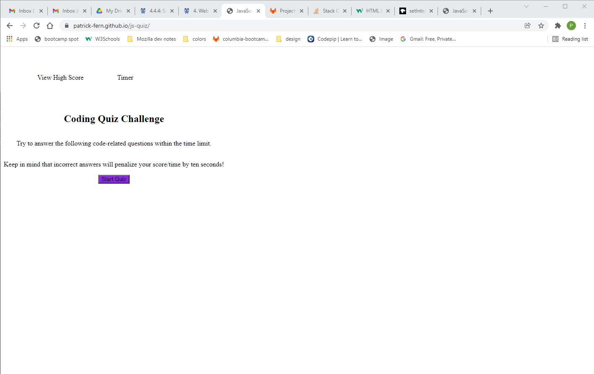

# JavaScript Quiz

## Purpose: 
A quiz which uses JavaScript, WEB APIs and the DOM to give users dynamic HTML and record their scores

## Built With
* HTML
* CSS
* JavaScript

## Website
https://patrick-fern.github.io/js-quiz/

## Repository
https://github.com/Patrick-Fern/js-quiz

## Screen shot of Website

## Contributions
Made by Patrick Fernbachg 